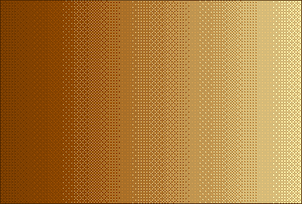

# NaqshSaz-Designs

## Designs

If you cannot open the `*.ns` file and need NaqshSaz software to check and test, you can download it at [https://github.com/BaseMax/NaqshSaz](https://github.com/BaseMax/NaqshSaz).

